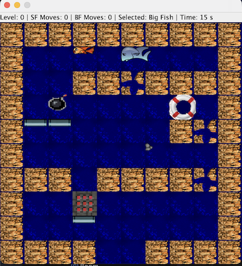
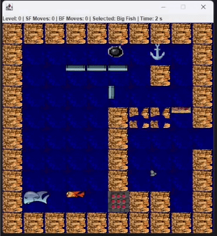

# Fish Fillets Java

A puzzle game inspired by [Fish Fillets NG](https://fillets.sourceforge.net/), built in Java as part of the Object-Oriented Programming course at ISCTE-IUL.

You control two fish, a big one and a small one, guiding them through levels by pushing objects out of the way until both reach the exit. Each fish has different physical limits, so every level is a logic puzzle that requires switching between them and thinking ahead.





## How to Play

Use the **arrow keys** to move and **Space** to switch between the two fish. Both need to reach the exit to complete a level. Press **R** to restart and **ESC** to quit.

Each fish has its own rules for pushing objects. The small fish can only push one light object at a time, while the big fish can push any number of objects horizontally but struggles vertically. Push the wrong thing at the wrong time and your fish dies, crushed, trapped, blown up, or eaten by a Krab.

## OOP Concepts

This project was built to practice core OOP principles, and they show up throughout the codebase:

- **Inheritance**: `GameObject` is the root of everything. `GameCharacter` extends it, and `BigFish` / `SmallFish` extend that.
- **Abstract classes**: `GameObject`, `MobileObjects`, `FixedObject` and `GameCharacter` define shared behaviour without being instantiated directly.
- **Interfaces**: `Movable`, `Deadly` and `Traversable` define capabilities that different objects can mix and match.
- **Singleton pattern**: `BigFish`, `SmallFish` and `ImageGUI` each have a single instance shared across the game.
- **Observer pattern**: `GameEngine` listens to `ImageGUI` for key presses and tick events.
- **Separation of concerns**: death logic lives entirely in `DeathManager`, keeping `GameEngine` clean.
- **Safe collection mutation**: `Room` queues additions and removals to avoid modifying lists mid-iteration.

## Project Structure

```
src/
├── objects/
│   ├── Characters/       # BigFish, SmallFish, Krab
│   ├── Fixed/            # Wall, HoleWall, SteelPipe, Trunk
│   ├── Movable/          # Anchor, Bomb, Buoy, Cup, Stone, Trap
│   └── interfaces/       # Movable, Deadly, Traversable
└── pt/iscte/poo/
    ├── game/             # GameEngine, Room, DeathManager, Main
    ├── gui/              # ImageGUI, ImageTile (provided by ISCTE-IUL)
    ├── observer/         # Observer, Observed (provided by ISCTE-IUL)
    └── utils/            # Direction, Point2D, Vector2D, Weight
rooms/                    # Level files
images/                   # Game sprites
sounds/                   # Audio files
```

## How to Run

You need Java 11 or higher and IntelliJ IDEA.

Clone the repo, open the project folder in IntelliJ, right-click the `src/` folder and mark it as Sources Root, then run `Main.java` inside `src/pt/iscte/poo/game/`.

The game needs to run from the project root so it can find the `images/`, `rooms/` and `sounds/` folders.

## Authors

Built by [@Galvidas](https://github.com/Galvidas) and [@etimass](https://github.com/etimass) for the Object-Oriented Programming course at ISCTE-IUL, Lisbon.
